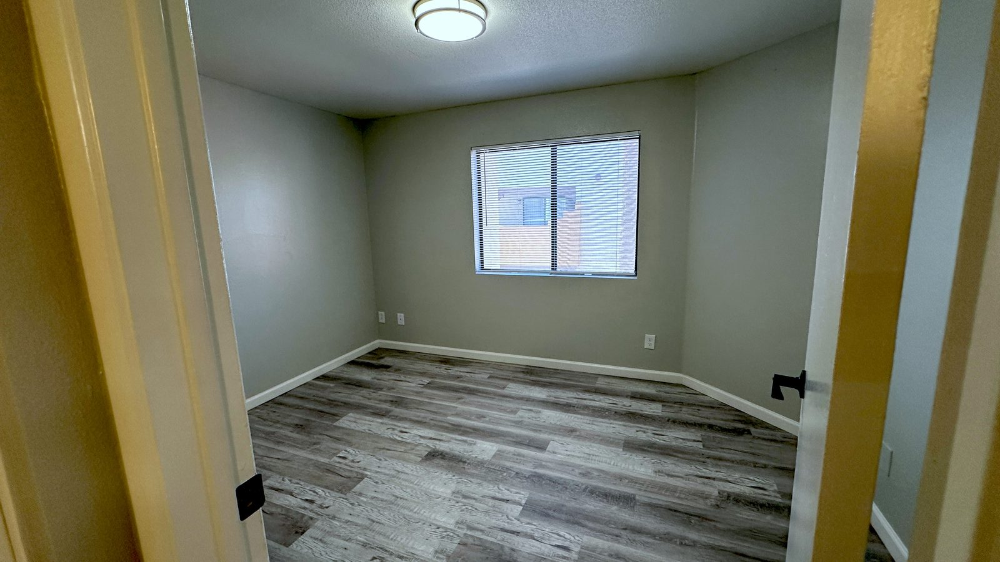

# Instructions for AI assistants working on this site

This is the website for La Mirage Apartments in Tempe. It is four plain HTML pages, one
stylesheet, and a `photos/` folder. There is no build step and no framework. Keep it that way:
no new libraries, no tooling, no JavaScript beyond the existing `lightbox.js`.

The people asking you for help are the owners, not developers. Explain what you did in plain
words and never leave placeholder text on a page.

## Adding or replacing a photo

1. **Never put a phone photo in `photos/` as-is.** Phone photos are 3 to 12 MB and carry the GPS
   location where they were taken. Shrink them first with the script in this repository:

   ```bash
   python3 resize-photos.py <folder of originals> <folder for results>
   ```

   It makes 1600-pixel JPEGs under about 300 KB and strips all metadata. It needs Python 3 and
   the Pillow library (`pip3 install pillow`). If the originals are `.heic`, export them as JPEG
   from the Photos app first.

2. **Check the photo before using it.** Do not add a photo that shows a person, a licence plate,
   a resident's belongings, or paperwork. Look for people reflected in mirrors and windows.

3. **Name it like the others.** Lower case, hyphens, a prefix for where it belongs:
   `1x1-…` for the one bedroom, `2x2-…` for the two bedroom, `amenity-…` for the pool, spa,
   grills and courtyard, `exterior-…` for the building and gate. For example `1x1-patio.jpg`.

4. **To replace a photo**, save the new file over the old one with the exact same name. No HTML
   changes are needed.

5. **To add a photo to a floor-plan page**, open `one-bedroom.html` or `two-bedroom.html`, find
   the block that starts `<div class="photo-grid">`, and copy one line of the form

   ```html
   <div class="ph"></div>
   ```

   Change the file name and write a short `alt` description of what the picture shows. The
   order of the lines is the order on the page. The first line has `class="ph wide"` and is the
   big photo at the top; there should be exactly one of those. Keep the floor plan drawing line
   last.

6. **The home page** shows one photo per floor-plan card and three amenity photos. Swap those by
   changing the file name in the matching `` line in `index.html`.

## Changing words, phone number, email, hours, rent

Search the HTML files for `EDIT:`. Each comment marks a spot and says what it is. The phone
number appears on every page, as both a `tel:` link and visible text, so change all copies.

## Git

Do not commit to `main`. Pushing to `main` publishes the site immediately. Make a branch, commit
there, and let the owner review and merge. To preview locally:

```bash
python3 -m http.server 8000
```

then open http://localhost:8000 in a browser.
